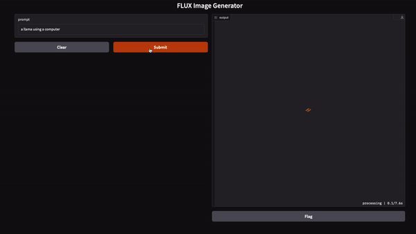

# codex

A collection of integration examples for CentML. This repository serves as a resource hub for developers looking to seamlessly incorporate CentML's capabilities into their applications. Explore a variety of use cases and implementations to accelerate your integration process.

# Chat Apps
chat-apps directory contains various examples of chat implementations leveraging CentML API. 

- bash 

- swift

- gradio

- html

- openai

- requests

- streamlit

# General Apps
apps that showcase advanced and general features integrating with CentML endpoints / compute / llm serving

- text to speech

- image generation

- llm debate

