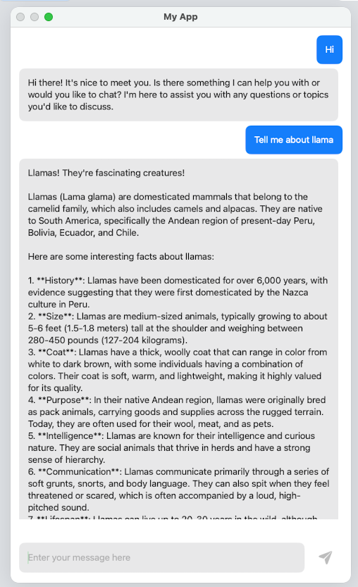

# Swift Playground AI Chat App

This project demonstrates how to build a simple SwiftUI-based chat interface that communicates with the CentML API for AI-generated responses. The app streams responses from the AI in real-time, creating an interactive chat experience.

## Setup Instructions

1. Create a New Swift Playground App

	•	Open Swift Playground and create a new Swift Playground app project.
	•	Name your project and set up the default settings for a SwiftUI app.

2. Add a ChatView File

	•	Create a new Swift file in your project and name it ChatView.swift.
	•	Copy the ChatView implementation provided and paste it into this new file. (Or import)

3. Add Your API Key

	•	In the ChatViewModel, replace the placeholder API key with your actual API key from CentML:
``` swift
let apiKey: String = "your_actual_api_key"
```


4. Update ContentView

	•	Open the ContentView.swift file in your project.
	•	Replace its body with ChatView() to make the chat interface the main view:
``` swift
struct ContentView: View {
    var body: some View {
        ChatView()
    }
}
```


5. Add Capability for Outgoing Connections

	•	Go to the app settings in your Swift Playground project.
	•	Enable the capability for Outgoing Connections to allow your app to make network requests to the CentML API.

6. Run the App and Chat with AI

	•	Build and run the app in the simulator or on your device.
	•	Type messages and interact with the AI in real-time!

This guide should help you quickly set up and run the chat app in Swift Playground. If any additional setup or configuration is required, refer to Xcode’s documentation for managing Swift Playgrounds.