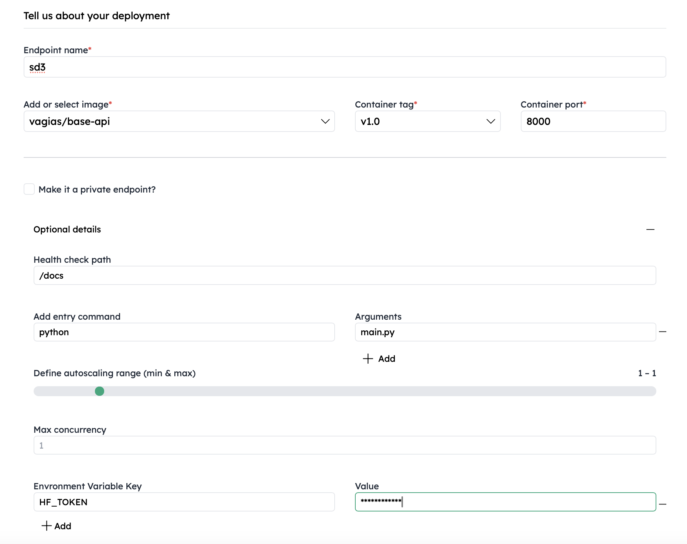

# FLUX Endpoint for CentML

This guide helps you deploy a Stable Diffusion endpoint on CentML using a pre-built Docker image or by building and pushing your own.

## Docker Image

- Use the pre-built image: vagias/base-api:v1.0
- Alternatively, build your own image locally and push it to Docker Hub.

## Building the Image

- For macOS

To build and push the image using buildx (for multi-platform support):
```bash
docker buildx build --platform linux/amd64,linux/arm64 -t {docker-username}/sd3-centml:v1.0 --push .
```

- For Linux

To build and push the image:
```bash
docker build -t {docker-username}/sd3-centml:v1.0 --push .
```

## Deploying on CentML

1. Log in to CentML
Access the CentML dashboard at https://app.centml.com.
2. Navigate to General Inference
From the Home page, go to General Inference to set up the deployment.
3. Fill in Deployment Details
Provide the necessary details, including:

- Docker image name

```bash
vagias/base-api # optional replace with your image
```
- Tag (e.g., v1.0)

```bash
v1.0
```
- Port number

```bash
8000
```
- Health check path

```bash
/docs
```

- Entry point arguments

```bash
python main.py
```

- Your HF_TOKEN (Hugging Face API token) for authentication
Example:


4. Select Resource Size
Choose the resource size based on your image generation speed requirements:
- Small
- Medium
- Large

5. Click Deploy

After deployment, you will receive an `endpoint URL`.

Interacting with the Endpoint

Once deployed, you can interact with the endpoint via:

- curl commands
- The included apps and examples

Use the provided URL to send requests and generate images with FLUX.

This version adds clarity and a more polished flow. Let me know if you’d like to include more details or examples for interacting with the endpoint!