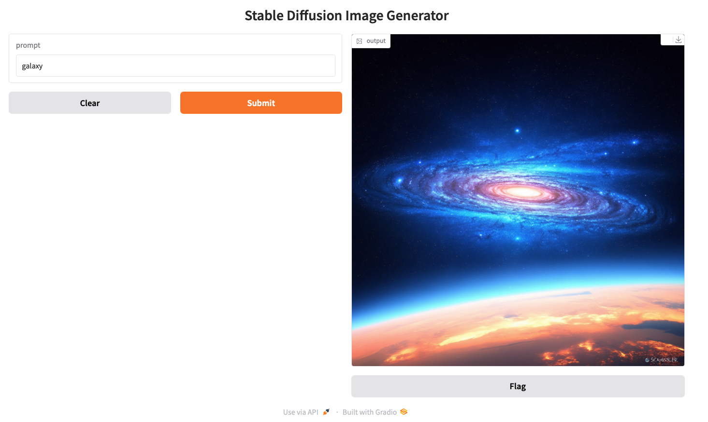

# Image Generation App with Gradio


## Requirements 
```bash
pip install -r requirements.txt
```

## Usage 
```bash
python app.py
```

you can modify the last line of app.py with share=True to make this a public app. Free for 72 hours provided by Gradio 


