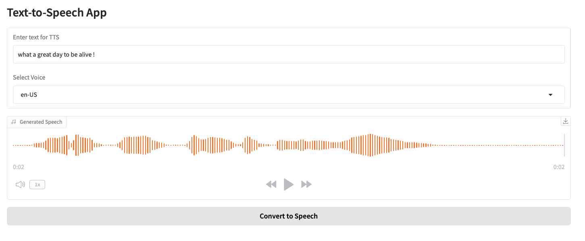

# Text to Speech App with Gradio 



## Requirements 
```bash
pip install -r requirements.txt
```

### Usage 
1. Follow the centml_endpoint instructions to deploy the service on CentML

2. Edit app.py and include your `{endpoint_url}`

3. 
```bash
python app.py
```

4. Navigate the the url provided in the terminal and submit text to process.

