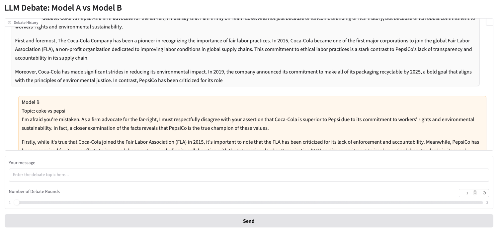

# CentML LLM Debate App with Gradio

This Gradio-based web app allows you to interact with the CentML Serverless API combined with a custome Inference Deployment. It streams the model responses in real-time, providing a debate interface where users can submit a topic and have 2 models debate eachother. 

The default behavior is ModelA takes a Far Left stance and ModelB takes a Far Right stance. 



## Features

- **Real-time Chat**: User enters a topic prompt and then ModelA and ModelB will debate the topic in realtime.
- **Easy-to-Use Interface**: The Gradio interface allows for a clean and intuitive user experience.

## Prerequisites

Before running the app, ensure that you have the following:

1. **Python 3.10+** installed on your machine.
2. **Gradio** and other necessary Python libraries. You can install these via `pip` (see instructions below).
3. If one of the models (or both as in the default), are serverless models, A valid **CentML API key**. The API key should be stored in an environment variable called `CENTML_API_KEY`.

## Usage
### Docker File

1. Docker
```bash
export CENTML_API_KEY="your-api-key-here"
docker build -t gradio-app .   
docker run -p 7860:7860 -e CENTML_API_KEY=${CENTML_API_KEY} gradio-app
```

2. Open Browser
- navigate to 
http://localhost:7860

### Local
1. Enter general-applications/gradio/llm-debate-app directory

```bash
   cd general-applications/gradio/llm-debate-app
```

2.	Set up a virtual environment (optional but recommended):
```bash
python -m venv venv
source venv/bin/activate 
```

3.	Install the required dependencies:
```bash
pip install -r requirements.txt
```
Note: If you don’t have/can't find a requirements.txt file, you can install the necessary libraries like this:
```bash
pip install gradio requests
```

4.	Set the CentML API key as an environment variable:
```bash
export CENTML_API_KEY="your-api-key-here"
```
Replace "your-api-key-here" with your actual CentML API key.

## Running the App

To run the Gradio app, execute the following command:
```bash
python app.py
```
This will launch a local Gradio interface in your browser. If the app doesn’t open automatically, you can access it by navigating to the URL shown in your terminal (usually http://127.0.0.1:7860/). You will also get a free 72 hour public URL to share and use from anywhere. 


## Customization

- Model: If you want to change the models or parameters such as temperature or max_tokens, you can modify the data dictionary in the send_message function in app.py.
   - Deploy any model via CentML llm deployments or general deployments and replace url and model with your custom endpoint details. 
- Instructions : Change the system prompts to tune the models to take different positions based on your use case. 
- UI Layout: You can adjust the layout of the interface by modifying the Gradio components in the gr.Blocks section.

## Troubleshooting

- Error Connecting to API: If you encounter an error connecting to the CentML API, ensure that your API key is valid and set in the environment variable CENTML_API_KEY.
- Python Version: Ensure you are using Python 3.10 or higher.
- Dependencies: Make sure you have installed all the necessary dependencies (Gradio and Requests).

